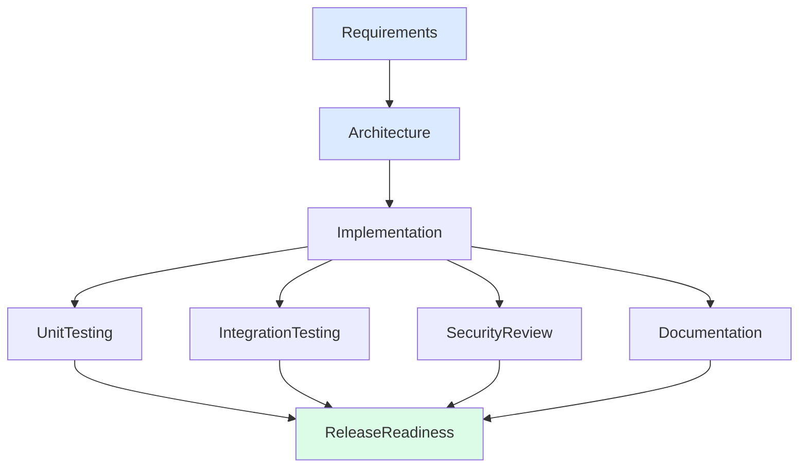
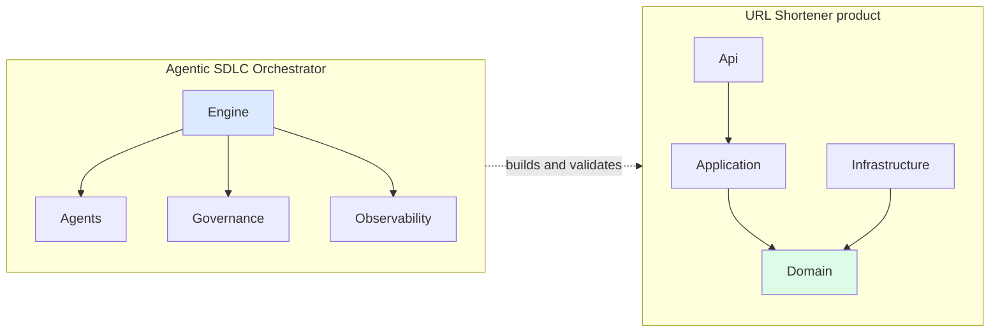
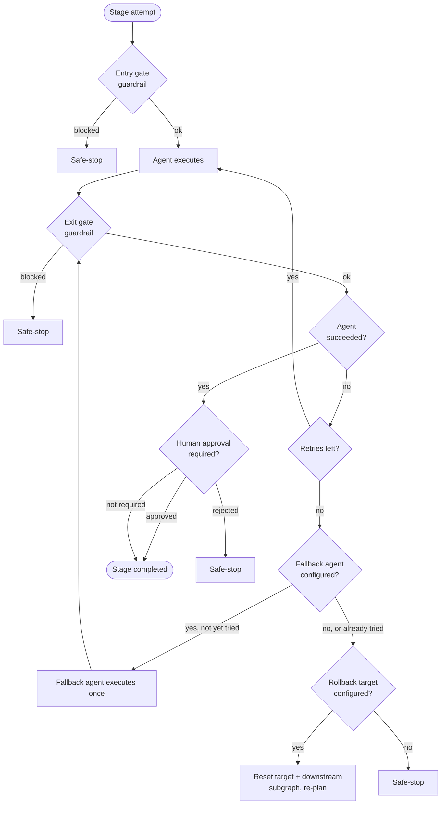

# URL Shortener + Agentic SDLC Orchestrator

[](LICENSE)

 

A URL shortener service (core APIs, analytics, reliability features) plus an
agentic orchestration layer that coordinates its own SDLC — requirements,
architecture, implementation, testing, documentation, and release readiness —
across explicit dependency graphs with governance, retries, rollback, and
audit-grade traceability.

This repo has two things in it, on purpose:

1. **`src/UrlShortener.*`** — the URL shortener itself: a clean-architecture
   .NET 8 Web API (Domain / Application / Infrastructure / Api) with SQLite,
   caching, rate limiting, analytics, and SSRF protection on user-supplied target URLs.
2. **`src/UrlShortener.Orchestrator`** — the agentic orchestration engine
   that *built and validates changes to* the URL shortener. It's a
   standalone console app with its own dependency graph, retry/rollback
   logic, policy guardrails, human-approval checkpoints, and metrics. This
   is the assignment's "critical differentiator" and is where most of the
   engineering effort went.

See `docs/architecture.md` for how the two relate, and `docs/scenarios/` for
the three required scenarios (greenfield, brownfield, ambiguous) walked
through in detail.

## Architecture at a glance



Requirements and Architecture run sequentially and require human approval.
Once Implementation finishes, UnitTesting, IntegrationTesting,
SecurityReview, and Documentation all run concurrently - this is the
non-linear, fan-out/fan-in execution the assignment calls for, not a
straight-line pipeline. ReleaseReadiness is the synchronization point: it
only starts once every parallel branch has finished. See
`docs/architecture.md` for the full model, including retry/fallback/
rollback/safe-stop control flow and a second diagram of that logic.
### Two systems, one repo



The product (top) is a normal layered .NET service. The orchestrator
(bottom) is a separate, general-purpose SDLC engine that happens to be
demonstrated against this product's codebase - it does not import or
depend on the product's assemblies.

### Retry, fallback, rollback, and safe-stop



Retry (same strategy, in place) is tried first, up to the stage's budget.
If exhausted, fallback (a different strategy, tried exactly once) runs
next. If that also fails, or no fallback is configured, the engine rolls
back to the nearest configured ancestor and re-plans its downstream
subgraph. If no rollback target exists, the pipeline safe-stops.
## A note on how this was built

This solution was authored with AI assistance (Claude) and then reviewed,
built, tested, and debugged by hand on a real Windows machine with the
.NET 8 SDK installed. The first draft was produced in a sandboxed
environment with no `dotnet` SDK access, so it was written and cross-checked
against known .NET 8 / EF Core 8 / ASP.NET Core minimal API / xUnit APIs by
inspection rather than by compiling — that first draft did have real bugs,
as expected. Running `dotnet build` and `dotnet test` for real surfaced
four genuine issues that inspection alone had missed (a couple of missing
`using` statements/NuGet package references, a value-type generic nullable
bug, and — the two substantive ones — a mismatch between the custom-alias
validator and the domain object's own length limit, and a SQLite/EF Core
limitation where `DateTimeOffset` range comparisons can't be translated to
SQL). All four are fixed, and the full test suite (68 tests across all four
projects) now passes. See `docs/testing-limitations-tradeoffs.md` for the
complete list of what's tested, what isn't, and the trade-offs made.

## Prerequisites

- [.NET 8 SDK](https://dotnet.microsoft.com/download/dotnet/8.0)
- No external services required — the API uses a local SQLite file, and the
  cache is in-process. Nothing to provision.

## Setup & run

```bash
# from the repo root
dotnet restore
dotnet build
```

### Run the API

```bash
dotnet run --project src/UrlShortener.Api
```

The API listens on the URL printed in the console (typically
`https://localhost:5001` / `http://localhost:5000` in Development). Swagger
UI is available at `/swagger` in the Development environment. The SQLite
database file is created automatically on first run (`urlshortener.dev.db`
in Development, `urlshortener.db` otherwise) — no migration step needed for
the prototype (see `docs/architecture.md` § Data & Migrations for the
production path).

Try it:

```bash
# create a short URL
curl -X POST http://localhost:5000/api/v1/urls \
  -H "Content-Type: application/json" \
  -d '{"targetUrl": "https://example.com/some/long/path"}'
# => { "code": "aB3xQ9z", "shortUrl": "https://short.link/aB3xQ9z", ... }

# follow it (302 redirect to the target)
curl -i http://localhost:5000/aB3xQ9z

# check analytics
curl http://localhost:5000/api/v1/urls/aB3xQ9z/analytics
```

### Run the tests

```bash
dotnet test
```

This runs unit tests (Domain, Application), integration tests (Api, against
an in-memory `TestServer` + throwaway SQLite file), and the orchestrator's
own engine + scenario tests.

### Run the agentic orchestrator

```bash
dotnet run --project src/UrlShortener.Orchestrator
```

This executes all three required scenarios (greenfield, brownfield,
ambiguous) back to back against the real engine, prints a summary to the
console, and writes the full audit trail, decision lineage, final stage
states, and reliability metrics for each run to `artifacts/sample-runs/`
(one set of four JSON files per scenario, e.g. `greenfield.audit.jsonl`,
`greenfield.metrics.json`, `greenfield.decision-lineage.json`,
`greenfield.stage-states.json`). Re-run it any time to regenerate them —
the scenarios are deterministic (scripted approvals, scripted failure
injection), so the output is stable across runs.

To run interactively (a real human types y/n at each approval checkpoint
instead of the scripted decisions), see `Governance/ApprovalGate.cs` -
`ConsoleApprovalProvider` is wired up but not the default; swap it in for
the scripted provider in a scenario's `Build()` method to try it.


### Run it live over HTTP

The scripted run above is the reproducible demo path. The same engine is also reachable live, over HTTP, through the API:

```powershell
dotnet run --project src/UrlShortener.Api
```

POST /api/v1/orchestrator/runs/greenfield starts a real run of the same Build() + ScenarioRunner.RunAsync() path in the background and returns a runId. Poll GET /api/v1/orchestrator/runs/greenfield/live/{runId} to watch it progress; when it reaches an approval gate the response includes a pendingApproval object, and you resolve it from a genuine HTTP caller by POSTing to .../live/{runId}/approve or .../reject.

Live-run artifacts are written to artifacts/live-runs/ (gitignored, since they are regenerated per run) rather than the checked-in artifacts/sample-runs/. See docs/SPEC.md section 2.5 for the full endpoint contract, and HttpApprovalProviderTests / OrchestratorEndpointsTests for the coverage.
## Project layout


<pre>
src/
  UrlShortener.Domain          - entities, value objects, domain exceptions, repository interfaces
  UrlShortener.Application     - CQRS commands/queries (MediatR), validation, abstractions
  UrlShortener.Infrastructure  - EF Core + SQLite, caching, code generation
  UrlShortener.Api             - minimal API endpoints, middleware, Program.cs
  UrlShortener.Orchestrator    - the agentic SDLC orchestration engine + 3 scenarios
tests/
  UrlShortener.Domain.Tests
  UrlShortener.Application.Tests
  UrlShortener.Api.IntegrationTests
  UrlShortener.Orchestrator.Tests
docs/
  architecture.md                       - components, orchestration model, control flow, key decisions
  engineering-summary.md                - plan/rationale, artifacts, risks, assumptions, limitations
  testing-limitations-tradeoffs.md      - testing approach, known limitations, trade-offs
  scenarios/
    greenfield.md
    brownfield.md
    ambiguous.md
artifacts/sample-runs/                  - generated by dotnet run --project src/UrlShortener.Orchestrator
</pre>

## API surface

| Method | Path | Description |
|---|---|---|
| `POST` | `/api/v1/urls` | Create a short URL (optional custom alias, expiry) |
| `GET` | `/{code}` | Redirect (302) to the target URL |
| `DELETE` | `/api/v1/urls/{code}` | Deactivate a short URL |
| `GET` | `/api/v1/urls/{code}/analytics` | Click analytics for a date range (default: last 30 days) |
| `GET` | `/health` | Liveness/readiness check |
| `GET` | `/api/v1/orchestrator/runs` | List orchestrator scenarios and their checked-in sample-run artifacts |
| `GET` | `/api/v1/orchestrator/runs/{scenario}` | Sample-run artifacts for one scenario |
| `POST` | `/api/v1/orchestrator/runs/{scenario}` | Start a live run of that scenario over HTTP (returns a runId) |
| `GET` | `/api/v1/orchestrator/runs/{scenario}/live/{runId}` | Poll a live run; includes pendingApproval when blocked on a gate |
| `POST` | `/api/v1/orchestrator/runs/{scenario}/live/{runId}/approve` | Approve the current pending gate |
| `POST` | `/api/v1/orchestrator/runs/{scenario}/live/{runId}/reject` | Reject the current pending gate (safe-stops the run) |

Full request/response contracts are in `src/UrlShortener.Api/Contracts` and
documented via Swagger at runtime.

## Optional: API-key auth on write endpoints

The Create and Deactivate endpoints accept an optional `ApiKey`. Unset by
default (so the steps above work with zero setup); to turn it on:

```powershell
$env:ApiKey = "some-secret-value"
dotnet run --project src/UrlShortener.Api
```

Once set, those two endpoints require a matching `X-Api-Key` header, or
they return 401. Redirect and analytics stay public, matching how a real
short-link service works. See `docs/testing-limitations-tradeoffs.md` for
what this does and does not protect against.
