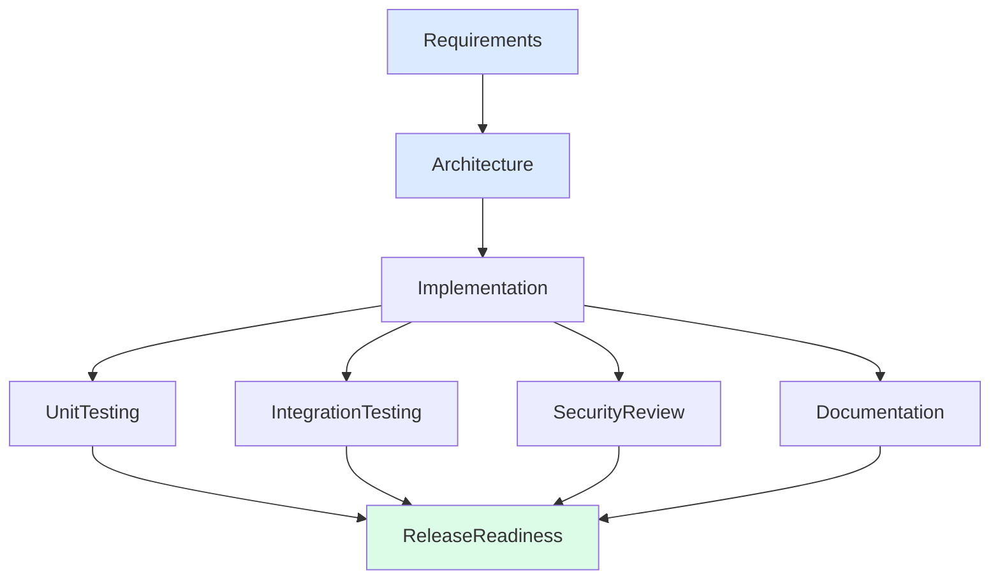
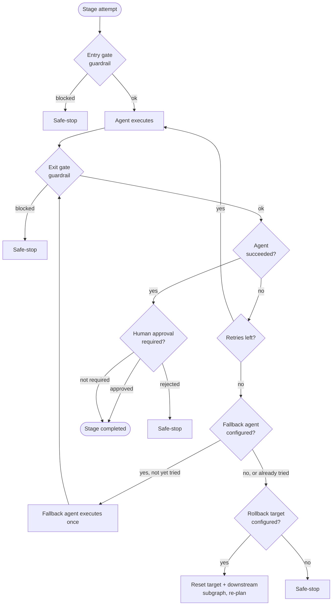

# Architecture Overview

## 1. Two systems, one repo

This assignment asks for both a working product (URL shortener) and an
agentic system that builds/maintains it. Rather than bolt the orchestrator
onto the product as a feature, they're kept as two independent things that
happen to live in one repo:

- **The product** (`UrlShortener.Domain/Application/Infrastructure/Api`) is
  a normal, boring, layered .NET service. Nothing about it is "agentic" -
  it's just correct.
- **The orchestrator** (`UrlShortener.Orchestrator`) is a general-purpose
  SDLC pipeline engine that happens to be demonstrated *against* this
  product's codebase (its scenarios reference real files, real bugs, real
  design trade-offs in `src/UrlShortener.*`). It doesn't import or depend on
  the product's assemblies at all - the coupling is only in the scenario
  narratives.

This separation is deliberate: it means the orchestration engine is judged
on its own design (graph model, gates, retries, rollback, guardrails,
metrics), not conflated with "did the CRUD app turn out well."

## 2. The product: URL shortener

Standard clean/onion architecture, dependency arrows point inward:

- **Domain**: `ShortUrl` (aggregate root) and `ClickEvent` (append-only
  analytics record, deliberately *not* nested under `ShortUrl` so
  high-volume click writes never contend with the aggregate's optimistic
  concurrency token). `ShortCode` is a validated value object. All
  invariants (URL format, expiry-in-the-future, active/expired/deactivated
  transitions) live on the entities, not in handlers - so they hold no
  matter which caller reaches them.
- **Application**: CQRS via MediatR. One command/query per use case
  (`CreateShortUrl`, `ResolveShortUrl`, `DeactivateShortUrl`,
  `GetUrlAnalytics`), each with its own handler and (where it takes user
  input) FluentValidation validator wired through a `ValidationBehavior`
  pipeline step, so validation failures come back as a typed `Result<T>`
  failure rather than an exception the API layer has to translate.
- **Infrastructure**: EF Core over SQLite (file-based - zero external
  services to provision for a take-home reviewer), an in-memory cache
  behind `ICacheService` (swappable for Redis - see § Scale below), and a
  cryptographically-random Base62 code generator.
- **Api**: ASP.NET Core minimal APIs. The redirect endpoint lives at the
  root (`GET /{code}`) rather than under `/api`, matching how a real short
  link looks to an end user; everything else is under `/api/v1/urls`.
  Fixed-window rate limiting (built into ASP.NET Core 8, no extra
  dependency) protects the create and redirect endpoints separately, since
  they have very different legitimate traffic shapes.

### Key decisions & why

| Decision | Alternative considered | Why this one |
|---|---|---|
| Random Base62 codes | Sequential/counter-based codes | Sequential codes let a caller enumerate every short URL in the system by incrementing an ID - an information-disclosure risk for a public redirect service. |
| Hash the client IP, never store it raw | Store raw IP for richer geo-analytics | PII minimization. This exact trade-off is also the guardrail trigger in the **ambiguous** scenario - see `docs/scenarios/ambiguous.md`. |
| Analytics write is best-effort (swallowed on failure) | Fail the redirect if the click can't be recorded | A redirect is the product's core promise; analytics is secondary. A slow/broken analytics write must never turn into a broken redirect. |
| SQLite + `EnsureCreated()` for this prototype | EF Core migrations | No `dotnet ef` tooling was available in the environment this was authored in (see root `README.md`). `EnsureCreated()` gets a reviewer to a working app with zero extra steps;

Requirements and Architecture are strictly sequential (each needs the
prior stage's output). Once Implementation completes, **UnitTesting,
IntegrationTesting, SecurityReview, and Documentation have no dependency on
each other** - the engine computes the "ready set" each round and runs all
of them concurrently (bounded by `OrchestrationOptions.MaxDegreeOfParallelism`,
default 4). ReleaseReadiness depends on all four, so it's the
**synchronization point**: it cannot become ready until every parallel
branch has reached a terminal state. This is the "non-linear, stateful
execution" the assignment calls for - not a `Requirements → ... → Release`
chain, but a real fan-out/fan-in graph.

The graph shape is fixed (`Scenarios/GraphFactory.cs`); what differs per
scenario is which agents run each stage, which guardrails are active, and
how the (scripted) human responds to approval checkpoints. This mirrors how
a real org would run one SDLC process across very different kinds of work.

### 3.2 Execution loop

`Engine/OrchestrationEngine.RunAsync` (see that file's XML doc for the
full contract) runs in rounds:

1. Compute the "ready" set: stages whose dependencies are all `Completed`
   and which aren't already running/done.
2. Run every ready stage concurrently this round (`Task.WhenAll`, bounded
   by a semaphore).
3. Recompute readiness and repeat, until nothing is ready (done, or
   blocked) or the pipeline is safe-stopped.

Round-based scheduling (rather than a continuously-polling scheduler) was a
deliberate simplification: it makes each run's stage ordering deterministic
and easy to reason about and test, at the cost of not being maximally
work-conserving (a stage that becomes ready mid-round waits for the round
boundary). For a pipeline whose stages take seconds-to-minutes, not
microseconds, that cost is negligible - see `docs/testing-limitations-tradeoffs.md`
for where this would need to change.

### 3.3 Entry/exit gates, human approval, and controlled autonomy

Each `StageNode` carries its own governance config (`Graph/StageNode.cs`):
`RequiresHumanApproval`, `MaxRetries`, and (via `OrchestrationOptions`) an
optional rollback target. A stage's agent runs autonomously; the *gate*
around it is what keeps a human in control of high-impact actions:

- **Entry**: a stage only becomes ready once its dependency gate is
  satisfied (§3.1).
- **Exit / approval**: if `RequiresHumanApproval` is set (Requirements,
  Architecture, and ReleaseReadiness, by default), the engine calls
  `IApprovalProvider.RequestApprovalAsync` after the agent succeeds but
  before the stage is marked `Completed`. This is a real seam, not a log
  line: `ScriptedApprovalProvider` drives the reproducible demo scenarios,
  `ConsoleApprovalProvider` lets an actual human type y/n. A rejection
  safe-stops the whole pipeline (§3.5) rather than silently retrying -
  rejecting a design is a governance decision, not a transient fault. An
  approval can also carry `Clarifications` back into the shared context
  (e.g. resolving an ambiguous requirement) - see `docs/scenarios/ambiguous.md`.

This is "controlled autonomy" concretely: agents execute multi-step work
end to end, but three checkpoints in the standard graph cannot be crossed
without a human decision, and the engine enforces that structurally (it's
not something an agent could skip by choosing to).

This is one layer of entry/exit gating - graph readiness in, human approval
out. §3.6 adds a second, independent layer around every stage attempt:
policy-guardrail entry/exit checks, which catch an unsafe precondition or
an unsafe output even when no human approval is configured for that stage.

### 3.4 Retries, fallback, rollback, and dynamic re-planning

Each stage has a bounded per-stage retry budget (`MaxRetries`). On failure,
the engine retries in place up to that budget (`Engine/OrchestrationEngine.ExecuteStageAsync`).
If the budget is exhausted, the engine has two further, distinct controls
before it gives up on the stage - fallback, then rollback:

- If the stage has a configured **fallback agent**
  (`OrchestrationOptions.FallbackAgents`), the engine tries it exactly once
  (`OrchestrationEngine.TryFallbackAsync`). This is deliberately not "retry
  again" - it's a different strategy for the same stage (e.g. a simpler or
  more conservative agent), tried locally, with no upstream/downstream
  re-planning. Its output still passes through the same exit-gate guardrail
  check as a primary attempt, and a success still goes through the stage's
  human-approval checkpoint if one is configured - a degraded result isn't
  exempt from either control. The audit log tags a fallback's success with
  `[fallback]` so the trail shows it wasn't the primary strategy that
  succeeded. If the fallback also fails, the engine falls through to
  rollback/safe-stop exactly as if no fallback had been configured.
- If the stage has a configured **rollback target**
  (`OrchestrationOptions.RollbackTargets`, e.g. "IntegrationTesting rolls
  back to Implementation"), the engine resets that target stage *and every
  stage transitively downstream of it* (`DependencyGraph.TransitiveDependents`)
  back to `Pending` - even ones that already completed in this run - and
  lets the normal ready-set computation re-schedule them. This is the
  **dynamic re-planning** requirement: the subgraph affected by an upstream
  change is recomputed, not the whole pipeline restarted from scratch.
  Rollbacks are themselves bounded (`OrchestrationOptions.MaxRollbacks`,
  default 1) so a stage that can never pass doesn't oscillate forever.
- If there's no rollback target (or the rollback budget is spent), the
  engine **safe-stops** the whole run.

The brownfield scenario (`docs/scenarios/brownfield.md`) is built
specifically to exercise this path end to end: a regression is discovered,
retried, rolled back, the implementation stage re-executes, and the
downstream stages re-run and pass - all without a human re-triggering
anything.

### 3.5 Safe-stop

Two things trigger an immediate, controlled halt of the entire pipeline
(`OrchestrationEngine.TriggerSafeStop`): a **blocking policy guardrail**
finding, or a **rejected human approval**. Both represent "this isn't a bug
to retry past, it's a decision that needs a human" - so the engine doesn't
try to recover automatically. In-flight stages in the same round finish
gracefully (no work is abandoned mid-write); no new stage is scheduled
afterward. The reason is recorded on the `PipelineResult` and in the audit
log, so a returning engineer sees exactly why the run stopped and where.

### 3.6 Policy guardrails (security, compliance, change control) and entry/exit gates

`Governance/PolicyGuardrail.cs` defines `IPolicyGuardrail.Evaluate(stage, artifacts)`.
The engine calls it at two points around every stage attempt
(`OrchestrationEngine.GatePhase`):

- **Entry gate** - evaluated immediately before the agent runs, against
  whatever is already in the artifact map (upstream stages' output, or this
  stage's own artifacts from a prior attempt). This is what stops a stage
  from starting at all when a precondition is already known to be unsafe,
  rather than only catching it after wasting an execution.
- **Exit gate** - evaluated immediately after the agent finishes, against
  the artifacts that attempt just produced. This is what catches a stage's
  own output being unsafe before the pipeline accepts it and moves on.

Both call the same guardrail set; only the timing (and therefore what's
in the artifact map to inspect) differs. The audit log tags every guardrail
event with which gate produced it (`[Entry gate]` / `[Exit gate]`), so the
distinction is visible in the trail, not just in code. Three guardrails are
implemented:

- `SecretScanningGuardrail` - flags hardcoded-credential-looking strings in
  generated code artifacts (Blocking).
- `DataPrivacyGuardrail` - flags a design/implementation that proposes
  persisting raw client IPs instead of a hash (Blocking) - this is what
  fires in the ambiguous scenario.
- `ChangeControlGuardrail` - warns (not blocks) if a release has no change
  ticket attached.

Guardrails are intentionally a **separate concern from the agent's own
output**: `SecurityReviewAgent` writes a review narrative, but it never
decides pass/fail on policy - that enforcement is independently auditable
in `IPolicyGuardrail`, so "what happened" (agent output) and "what's
allowed" (policy) can be reasoned about and changed separately.

### 3.7 Observability, audit trail, and decision lineage

Two complementary records come out of every run:

- **`AuditLog`** (`Governance/AuditLog.cs`): an append-only, timestamped,
  JSON-serializable event stream (pipeline start/end, every stage
  start/retry/success/failure, every guardrail evaluation, every approval
  request/grant/reject, every rollback/re-plan) tagged with a stable
  correlation ID per run. This is the audit-grade traceability requirement
  - it's a byproduct of execution, not reconstructed after the fact.
- **`PipelineExecutionContext.Lineage`** (`Engine/PipelineExecutionContext.cs`):
  an ordered list of `DecisionRecord`s (what was decided, why, by whom) that
  agents and the engine append to as they go - e.g. "design proposed
  touching 3 modules," "human approved with clarification X," "rolled back
  to Implementation because Y." Where the audit log answers "what
  happened," the lineage answers "why" in the language of the domain, and
  is what a later stage (or a human reviewing the run) reads to understand
  upstream reasoning without re-deriving it.

**`MetricsCollector`** (`Observability/MetricsCollector.cs`) tracks exactly
the reliability metrics called out in the assignment: success rate,
retry count, fallback count, rollback count, replan count, mean time to recovery (elapsed
time between a stage's first failure and its eventual success, including
across a rollback+rework cycle), and total end-to-end latency. `ScenarioRunner`
writes all of this to `artifacts/sample-runs/` per scenario run.

### 3.8 Agent simulation model (and why)

Each SDLC stage's worker (`Agents/*.cs`) implements `IAgent.ExecuteAsync`
with **deterministic, inspectable simulated reasoning** rather than calling
a live LLM API. This was a conscious choice, not a shortcut:

- The artifact being evaluated here is the **orchestration engine** -
  the dependency graph, gates, retries, rollback, guardrails, and metrics.
  A deterministic agent makes all three required scenarios exactly
  reproducible for review (same input → same sequence of
  retries/rollbacks/approvals, every time), which a live LLM call would
  not guarantee.
- `IAgent` is precisely the seam where a real LLM- or Copilot-backed worker
  would plug in - swap the implementation, keep the engine, gates, and
  audit trail unchanged. Nothing about the engine assumes a simulated
  agent; `ExecuteAsync` is `async` and takes a `CancellationToken`
  specifically so a real network-calling implementation drops in without
  any interface change.
- Where the assignment says "using AI assistance (Copilot/Claude/etc.)" -
  that describes how *this repository itself* was built (see root
  `README.md`), not a requirement that the orchestrator's demo agents make
  live model calls to be a legitimate demonstration of the orchestration
  model.

## 4. Data & Migrations

The prototype calls `AppDbContext.Database.EnsureCreated()` on startup
(see `Program.cs`) instead of using EF Core migrations, because the
environment this solution was authored in had no working `dotnet ef`
tooling (network-restricted sandbox - see root `README.md`). Before any
real deployment:

```bash
dotnet tool install --global dotnet-ef
dotnet ef migrations add InitialCreate --project src/UrlShortener.Infrastructure --startup-project src/UrlShortener.Api
```

then replace `EnsureCreated()` with `Database.Migrate()` in `Program.cs`.
`EnsureCreated()` and migrations are mutually exclusive by design (EF Core
throws if you mix them against the same database), so this is a clean
one-line swap, not a refactor.

## 5. Where this would go next

- Replace `MemoryCacheService` with a Redis-backed `ICacheService` for
  multi-instance deployment.
- Add real authentication and use it (not just an unauthenticated
  `ownerId` string) to gate deactivate/analytics access.
- Move the orchestrator's round-based scheduler to an event-driven one if
  stage latencies ever become small enough for round-boundary overhead to
  matter (see `docs/testing-limitations-tradeoffs.md`).
- Give `IApprovalProvider` a real transport (Slack/Teams/email webhook)
  for the `Deferred` decision path, which today is implemented but unused
  by any scripted scenario.
## 6. Diagrams

### Orchestration graph and control flow



Requirements and Architecture run sequentially. Once Implementation
completes, UnitTesting, IntegrationTesting, SecurityReview, and
Documentation run concurrently (bounded parallelism). ReleaseReadiness is
the synchronization point - it cannot start until all four branches reach
a terminal state.

### Stage execution: retry, fallback, rollback, safe-stop



Retry (same strategy, in place) is tried first, up to the stage's budget.
If exhausted, fallback (a different strategy, tried exactly once) runs
next. If that also fails, or no fallback is configured, the engine rolls
back to the nearest configured ancestor and re-plans its downstream
subgraph. If no rollback target exists, the pipeline safe-stops.
